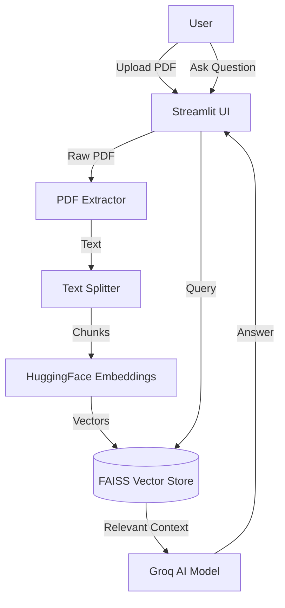

# 📘 About PDF Intelligent Analyzer

Welcome to the **PDF Intelligent Analyzer** documentation. This project is a **RAG (Retrieval-Augmented Generation)** application designed to extract insights from PDF documents using advanced AI models.

## 📂 Project Structure

Here is a detailed breakdown of the codebase:

```text
pdf-analyzer/
├── app.py                # 🚀 Entry Point: The main Streamlit application file.
├── pdf_utils.py          # ⚙️ Logic Layer: Contains core functions for processing and AI.
├── requirements.txt      # 📦 Dependencies: List of Python libraries required.
├── .env                  # 🔐 Secrets: Stores API keys (not pushed to GitHub).
├── .gitignore            # 🙈 Ignore List: Files to exclude from Git (like .env).
└── README.md             # 📄 Overview: Basic project introduction.
```

### Detailed File Descriptions

- **`app.py`**:
  - **Frontend**: Renders the UI using Streamlit (Sidebar, Buttons, Inputs).
  - **State Management**: Handles file uploads and user sessions.
  - **Orchestration**: Calls functions from `pdf_utils.py` to process data and display results.
  - **Styling**: Injects custom CSS for a professional, "human-made" look and theme toggling.

- **`pdf_utils.py`**:
  - **`extract_text_from_pdf`**: Reads raw PDF files and converts them to string.
  - **`split_text_with_overlap`**: Breaks long text into smaller, manageable chunks (e.g., 500 chars) to fit into the AI's context window.
  - **`store_chunks_in_faiss`**: Converts text chunks into numerical vectors (embeddings) and stores them in the FAISS database.
  - **`query_pdf_with_retrieval_qa`**: The "Brain". It takes your question, finds relevant chunks in FAISS, and sends them to the Groq LLM to generate an answer.

---

## 🎨 Frontend Architecture (The User Interface)

The frontend is built entirely in **Python** using **Streamlit**. It acts as the bridge between the user and the powerful AI backend.

### 1. **Reactive UI Components**
Streamlit runs the entire Python script from top to bottom whenever an interaction occurs.
- **Sidebar**: Used for configuration (Theme Toggle) and data input (PDF Uploader). It keeps the main area clean.
- **Main Area**: Displays the chat interface and results. It uses `st.columns` to create a responsive layout.
- **Theme Toggle**: A custom logic that injects different CSS blocks based on the user's selection (Light/Dark), overriding the default Streamlit styles for a "human-made" professional look.

### 2. **State Management**
Since Streamlit re-runs the script on every click, we rely on:
- **`st.file_uploader`**: Persists the uploaded file object across re-runs.
- **Session State** (Implicit): While we don't explicitly use `st.session_state` for complex history yet, the app's linear flow ensures that once variables like `uploaded_files` are populated, the downstream logic (Processing) is triggered automatically.

### 3. **Custom Styling**
We don't just use default Streamlit widgets. We inject **HTML/CSS** via `st.markdown(..., unsafe_allow_html=True)` to:
- Customize button colors and hover effects.
- Create card-like containers for the AI response.
- Enforce specific fonts (Inter/System fonts) for better readability.

---

## ⚙️ Backend Architecture (The Logic Core)

The backend is "Serverless" in the sense that it runs within the same process as the frontend, but it is logically distinct. It handles the heavy lifting of RAG (Retrieval-Augmented Generation).

### 1. **Data Ingestion Pipeline**
When a file is uploaded, the backend performs a sequence of operations:
- **Parsing**: `PyPDF2` reads the binary PDF stream and extracts raw text strings.
- **Cleaning**: (Implicit) The extracted text is concatenated into a single corpus.

### 2. **Context Awareness (RAG)**
This is the core intelligence of the system.
- **Chunking**: We can't feed a 100-page PDF to an AI at once (it exceeds the "context window").
  - We split the text into **500-character chunks**.
  - We add a **100-character overlap** between chunks so sentences aren't cut off mid-thought.
- **Vectorization**:
  - Each chunk is passed through the `sentence-transformers/all-MiniLM-L6-v2` model.
  - This converts text into a **384-dimensional vector** (a list of 384 numbers).

### 3. **In-Memory Database (FAISS)**
- We use **FAISS** to index these vectors.
- When you ask a question, your question is *also* converted into a vector.
- FAISS performs a **Nearest Neighbor Search** to find the 3-4 chunks of text that are most mathematically similar to your question.

### 4. **Inference Engine (Groq)**
- The retrieved chunks + your question are packaged into a prompt:
  > "Use the following context to answer the user's question: [Chunks]... Question: [User Query]"
- This prompt is sent to **Groq's API**, which hosts the **OpenAI/Llama** model.
- Groq processes this at lightning speed (~500 tokens/sec) and returns the natural language answer.

---

## 🛣️ How "Routes" & App Flow Work

Since this is a **Streamlit** Single-Page Application (SPA), it doesn't use traditional URL routes (like `/login` or `/dashboard`). Instead, the flow is **linear and reactive**:

1.  **Initialization**:
    - The app loads environment variables (`.env`).
    - The UI layout (Sidebar + Main Area) is rendered.

2.  **Data Ingestion (The Upload "Route")**:
    - **Trigger**: User uploads a PDF in the sidebar.
    - **Action**: The app reads the file into memory.

3.  **Processing Pipeline**:
    - **Text Extraction**: PDF content is converted to text.
    - **Chunking**: Text is split into overlapping segments to preserve context.
    - **Vectorization**: Chunks are embedded and indexed in FAISS (see below).

4.  **Interaction (The Query "Route")**:
    - **Trigger**: User types a question and clicks "Analyze".
    - **Action**:
        - The app searches the **Vector DB** for text related to the question.
        - The relevant text + the question are sent to the **LLM** (Groq).
    - **Result**: The AI's response is displayed in the "Analysis Result" box.

---

## 💽 How the Database Works (FAISS)

This project uses **FAISS (Facebook AI Similarity Search)** as its "Database". It is not a traditional SQL database (like MySQL) but a **Vector Store**.

### The Process:
1.  **Embeddings**:
    - We use the `sentence-transformers/all-MiniLM-L6-v2` model.
    - This model translates text into a list of numbers (a vector) representing its *meaning*.
    - Example: "Apple" and "Fruit" will have similar vector numbers.

2.  **Storage**:
    - These vectors are stored in **RAM** (In-Memory) using FAISS.
    - This allows for lightning-fast searches.

3.  **Retrieval (Semantic Search)**:
    - When you ask "What is the revenue?", the system converts your question into a vector.
    - It compares this vector with all stored PDF vectors.
    - It retrieves the chunks that are mathematically closest (most similar in meaning) to your question.

---

## 📦 Dependencies Explained

Here is why we chose each library in `requirements.txt`:

| Dependency | Purpose | Why we used it? |
| :--- | :--- | :--- |
| **`streamlit`** | **Frontend UI** | It is the fastest way to build data apps in Python. It handles the web server, UI components, and reactivity without needing HTML/CSS/JS. |
| **`langchain`** | **Orchestration Framework** | It acts as the "glue" connecting the PDF loader, the Vector DB, and the LLM. It simplifies building RAG pipelines. |
| **`langchain-groq`** | **LLM Integration** | Specifically designed to connect LangChain with **Groq's** ultra-fast inference engine, which powers our Llama3/Mixtral models. |
| **`langchain-huggingface`** | **Embeddings** | Allows us to use open-source embedding models (like `all-MiniLM-L6-v2`) from Hugging Face to convert text into vectors. |
| **`faiss-cpu`** | **Vector Database** | A library by Facebook Research for efficient similarity search. We use the CPU version because it's lightweight and works everywhere (no GPU required). |
| **`PyPDF2`** | **PDF Parser** | A pure-Python library to read PDF files. We use it to extract raw text from the uploaded documents. |
| **`python-dotenv`** | **Security** | Loads configuration (like API keys) from a `.env` file, keeping secrets out of the code and secure. |
| **`sentence-transformers`** | **Model Architecture** | The underlying library that powers the embedding generation. It ensures our text-to-vector conversion is accurate and semantic. |

---

## 🧠 Project Architecture



### Tech Stack
- **Frontend**: Streamlit
- **LLM Provider**: Groq (fast inference)
- **Model**: `openai/gpt-oss-120b` (or similar high-performance open model)
- **Embeddings**: HuggingFace (`all-MiniLM-L6-v2`)
- **Orchestration**: LangChain
