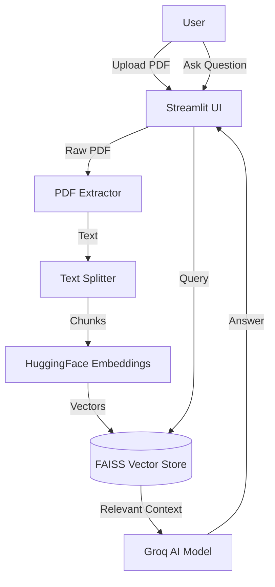

# 📘 About PDF Intelligent Analyzer

Welcome to the **PDF Intelligent Analyzer** documentation. This project is a **RAG (Retrieval-Augmented Generation)** application designed to extract insights from PDF documents using advanced AI models.

## 📂 Project Structure

Here is a detailed breakdown of the codebase:

```text
pdf-analyzer/
├── app.py                # 🚀 Entry Point: The main Streamlit application file.
├── pdf_utils.py          # ⚙️ Logic Layer: Contains core functions for processing and AI.
├── requirements.txt      # 📦 Dependencies: List of Python libraries required.
├── .env                  # 🔐 Secrets: Stores API keys (not pushed to GitHub).
├── .gitignore            # 🙈 Ignore List: Files to exclude from Git (like .env).
└── README.md             # 📄 Overview: Basic project introduction.
```

### Detailed File Descriptions

- **`app.py`**:
  - **Frontend**: Renders the UI using Streamlit (Sidebar, Buttons, Inputs).
  - **State Management**: Handles file uploads and user sessions.
  - **Orchestration**: Calls functions from `pdf_utils.py` to process data and display results.
  - **Styling**: Injects custom CSS for a professional, "human-made" look and theme toggling.

- **`pdf_utils.py`**:
  - **`extract_text_from_pdf`**: Reads raw PDF files and converts them to string.
  - **`split_text_with_overlap`**: Breaks long text into smaller, manageable chunks (e.g., 500 chars) to fit into the AI's context window.
  - **`store_chunks_in_faiss`**: Converts text chunks into numerical vectors (embeddings) and stores them in the FAISS database.
  - **`query_pdf_with_retrieval_qa`**: The "Brain". It takes your question, finds relevant chunks in FAISS, and sends them to the Groq LLM to generate an answer.

---

## 🛣️ How "Routes" & App Flow Work

Since this is a **Streamlit** Single-Page Application (SPA), it doesn't use traditional URL routes (like `/login` or `/dashboard`). Instead, the flow is **linear and reactive**:

1.  **Initialization**:
    - The app loads environment variables (`.env`).
    - The UI layout (Sidebar + Main Area) is rendered.

2.  **Data Ingestion (The Upload "Route")**:
    - **Trigger**: User uploads a PDF in the sidebar.
    - **Action**: The app reads the file into memory.

3.  **Processing Pipeline**:
    - **Text Extraction**: PDF content is converted to text.
    - **Chunking**: Text is split into overlapping segments to preserve context.
    - **Vectorization**: Chunks are embedded and indexed in FAISS (see below).

4.  **Interaction (The Query "Route")**:
    - **Trigger**: User types a question and clicks "Analyze".
    - **Action**:
        - The app searches the **Vector DB** for text related to the question.
        - The relevant text + the question are sent to the **LLM** (Groq).
    - **Result**: The AI's response is displayed in the "Analysis Result" box.

---

## 💽 How the Database Works (FAISS)

This project uses **FAISS (Facebook AI Similarity Search)** as its "Database". It is not a traditional SQL database (like MySQL) but a **Vector Store**.

### The Process:
1.  **Embeddings**:
    - We use the `sentence-transformers/all-MiniLM-L6-v2` model.
    - This model translates text into a list of numbers (a vector) representing its *meaning*.
    - Example: "Apple" and "Fruit" will have similar vector numbers.

2.  **Storage**:
    - These vectors are stored in **RAM** (In-Memory) using FAISS.
    - This allows for lightning-fast searches.

3.  **Retrieval (Semantic Search)**:
    - When you ask "What is the revenue?", the system converts your question into a vector.
    - It compares this vector with all stored PDF vectors.
    - It retrieves the chunks that are mathematically closest (most similar in meaning) to your question.

---

## 🧠 Project Architecture



### Tech Stack
- **Frontend**: Streamlit
- **LLM Provider**: Groq (fast inference)
- **Model**: `openai/gpt-oss-120b` (or similar high-performance open model)
- **Embeddings**: HuggingFace (`all-MiniLM-L6-v2`)
- **Orchestration**: LangChain
